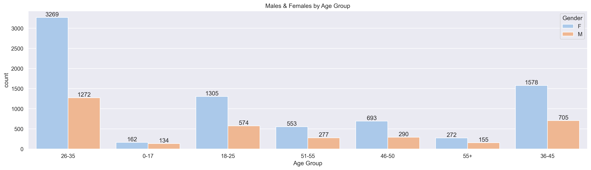
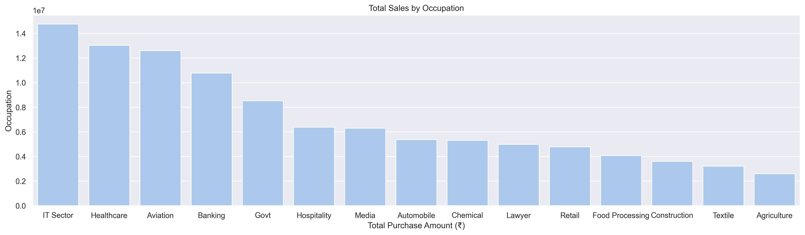
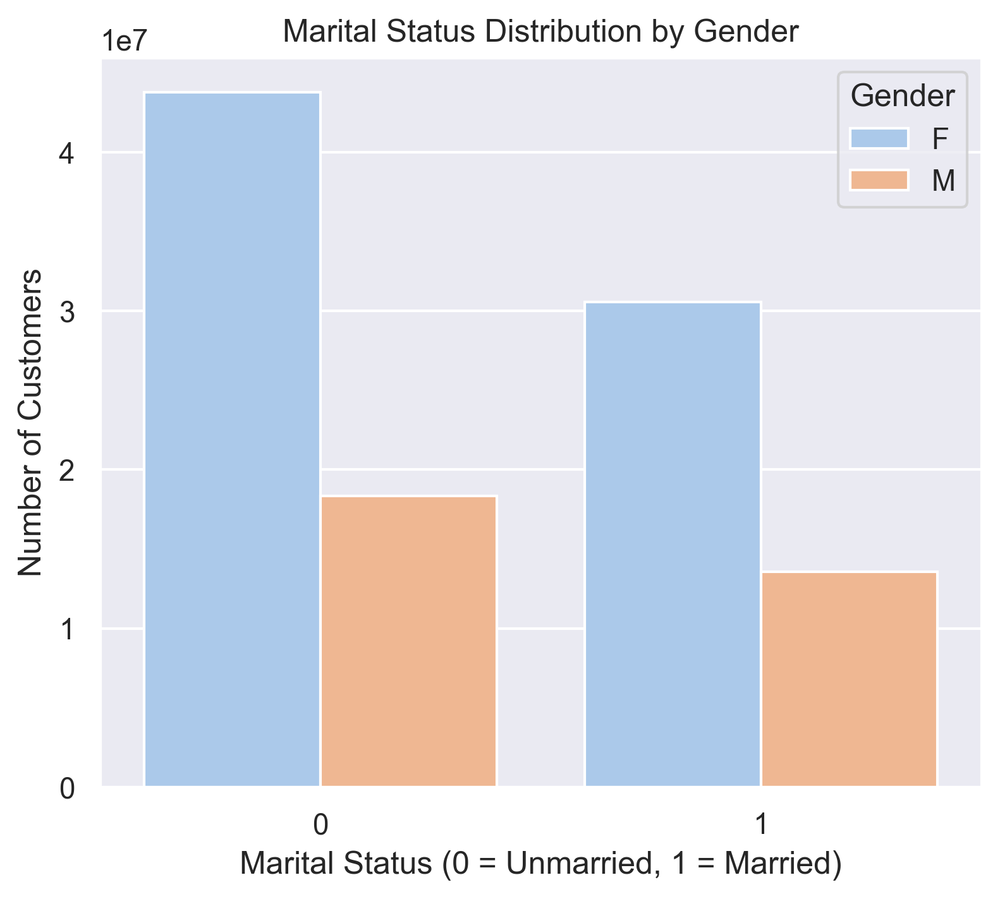

# 🪔 Diwali Sales Analysis (Python Project)

A **data analysis project** to explore and visualize **Diwali sales trends** using Python.  
This project uncovers **key insights about customer behavior, top-performing states, occupations, and product categories** — helping businesses make **data-driven marketing decisions** during festive seasons.

---

## 📊 Project Overview

This analysis uses a **real-world Diwali sales dataset** to understand:

- 💰 Which **gender and age group** spend the most  
- 🏙️ Which **states and occupations** contribute highest to sales  
- 🛍️ Which **product categories** are most popular  
- 🎯 How **customer demographics** affect purchase patterns  

---

## 🧠 Key Insights

- 👩 **Women** contribute more to total sales compared to men.  
- 🧾 The **26–35 age group** shows the highest purchase value.  
- 💼 **Married** individuals tend to spend more than singles.  
- 🏙️ Top 3 states by total sales: **Uttar Pradesh, Maharashtra, and Karnataka**.  
- 👨‍💻 **IT, Healthcare, and Aviation** professionals dominate purchases.  
- 🛒 **Clothing and Electronics** are the most purchased product categories.

---

## ⚙️ Tools & Libraries Used


---

## 📂 Project Structure
```bash
Diwali_Sales_Analysis/
│
├── 📘 Diwali_Sales_Analysis.ipynb      # Main analysis notebook
├── 📄 Diwali_Sales_Data.csv            # Dataset file
├── 🖼️ images/                          # Folder containing chart images
│ ├── male_female_by_age.png
│ ├── total_sales_by_occupation.png
│ └── marital_status_distribution.png
└── 📜 README.md                        # Project documentation
```

---

## 📸 Project Preview

Here are some sample visualizations from the analysis:

### 1️⃣ Male & Female by Age Group
This chart shows how **age and gender** affect purchase amounts, with women in the 26–35 age group contributing the most.


&nbsp;

### 2️⃣ Total Sales by Occupation
This bar chart highlights how **different occupations** contribute to Diwali sales, with **IT, Healthcare, and Aviation** professionals being top spenders.


&nbsp;

### 3️⃣ Marital Status Distribution by Gender
This chart displays how **marital status influences spending behavior**, showing that **married women** lead in total purchase value.


&nbsp;

---

## 📈 Visualizations

The notebook includes:

| Chart | Description | Graph Title |
|--------|-------------|--------------|
| Bar Plot | Total Amount by Gender | **Total Amount vs Gender** |
| Bar Plot | Total Amount by Age Group | **Total Amount vs Age Group** |
| Count Plot | Marital Status Distribution | **Marital Status Count** |
| Bar Plot | Total Amount by State | **Top States by Total Amount** |
| Bar Plot | Total Amount by Occupation | **Top Occupations by Total Amount** |
| Bar Plot | Total Amount by Product Category | **Top Product Categories** |
| Count Plot | Orders by Product Category | **Total Orders by Category** |

---

## 🪄 Step-by-Step Workflow

1. **Import Libraries** → Pandas, Matplotlib, Seaborn  
2. **Load Dataset** → `Diwali_Sales_Data.csv`  
3. **Data Cleaning** → Remove nulls, handle incorrect entries  
4. **Exploratory Data Analysis (EDA)** → Understand demographics & purchase behavior  
5. **Visualization** → Use Seaborn & Matplotlib to identify patterns  
6. **Insights & Conclusions** → Summarize business recommendations  

---

## 🏁 Conclusion

- Married women (aged 26–35) are the **key customer segment** with the highest spending.  
- **Clothing and Electronics** are the most popular product categories.  
- **Uttar Pradesh, Maharashtra, and Karnataka** lead in total sales.  
- These insights can help businesses plan effective **marketing campaigns, festive discounts, and product promotions** to boost Diwali season revenue.

---

## 🚀 How to Run

1. Clone this repository  
```bash
git clone https://github.com/Harsh-Belekar/Diwali-Sales-Analysis-Python.git
cd Diwali-Sales-Analysis
```

2. Install dependencies
```bash
pip install pandas numpy matplotlib seaborn
```
3. Open the notebook
```bash
jupyter notebook Diwali_Sales_Analysis.ipynb
```

---

## 🧩 Skills Demonstrated

 - Data Cleaning & Preprocessing

 - Exploratory Data Analysis (EDA)

 - Data Visualization (Seaborn, Matplotlib)

 - Business Insights & Storytelling

 - Python (Pandas, Numpy)

---

## 🧠 Author

**👤 Harsh Belekar**  
📍 Data Analyst | Python | SQL | Power BI | Excel | Data Visualization  
🔗 [LinkedIn](https://www.linkedin.com/in/harshbelekar) | [GitHub](https://github.com/Harsh-Belekar)

📧 **harshbelekar74@gmail.com**
